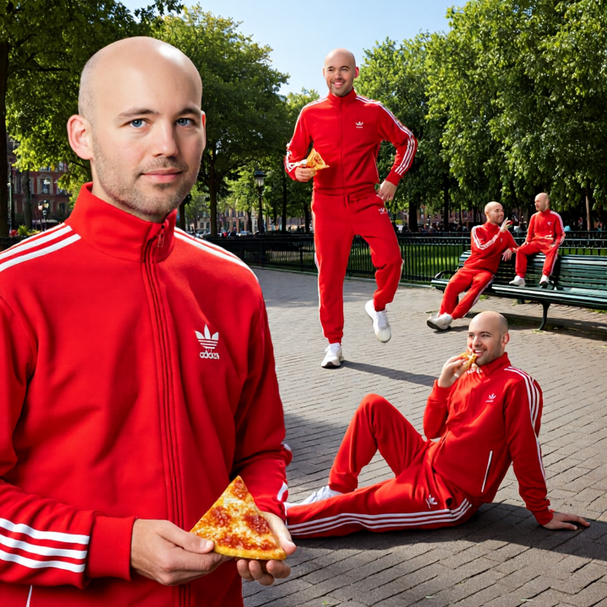

# 🦉 Brain Cells - Intelligent Spreadsheet Automation

<div align="center">
  
  **Kennesaw State University**  
  **Office of Research**
  
  *Advancing Research Through AI Innovation*  
  *Project Lead: Dylan Goldblatt*
  
  <br>
  
  🎉 **Compiled in celebration of the Fall 2025 semester kickoff at**
  
  <a href="https://www.hatchbridge.com">
    
  </a>
</div>

---

## 🧠 What is Brain Cells?

**Brain Cells** brings intelligent automation to the spreadsheet interface, fully locally. This starter kit combines the best open source and open weights projects into a unified platform:

- **🤗 Hugging Face Sheets** - Open source spreadsheet interface for AI-powered data manipulation
- **🕷️ Crawl4AI** - Advanced web scraping and data extraction
- **🤖 Ollama** - Local LLM runtime for complete privacy
- **🎯 Open Weights Models** - Run state-of-the-art models without cloud dependencies

Developed by **Dylan Goldblatt** at the **Kennesaw State University Office of Research**, Brain Cells transforms your research workstation into an intelligent data processing hub – think of each cell in your spreadsheet as a "brain cell" capable of understanding and transforming data.

### 👥 Meet Our Elite Research Team

<div align="center">
  
  
  *Our dedicated research team demonstrating proper collaborative debugging posture*
</div>

When your code works on the first try, this is how the entire Office of Research celebrates. Join us in advancing AI research with style!

### 🎯 Open Source Components

| Service  | What it does | Default URL |
|----------|--------------|-------------|
| **Hugging Face Sheets** | Open source spreadsheet UI for prompting, cleaning & enriching data with any LLM | <http://localhost:3000> |
| **Ollama**    | Open source local model runner with open weights LLMs | <http://localhost:11434> (REST) |
| **Crawl4AI** | Open source web crawler/scraper optimized for LLM data pipelines | CLI in the `crawl4ai` container |

> 📝 **Attribution:** Brain Cells is a bundle created from the open source [Hugging Face AI Sheets](https://huggingface.co/spaces/HuggingFace/ai-sheets) project, enhanced with intelligent automation features and customized for research use.

---

## ✨ Why Brain Cells?

* **🧠 Intelligent Cells** – Every spreadsheet cell becomes a "brain cell" capable of AI-powered transformations
* **🌐 100% Open Source** – Built entirely on open source projects and open weights models
* **🔒 Completely Local** – Your data never leaves your machine, ensuring complete privacy
* **🔑 Flexible Integration** – Works with Hugging Face, OpenAI, Anthropic, or run entirely offline
* **🎯 Hardware-Optimized** – Choose from various open weights models to match your hardware
* **🚀 Zero-Configuration** – Pre-configured Docker stack gets you running in minutes
* **📊 Research-Grade** – Trusted by KSU researchers for sensitive data processing

---

## 🦉 Quick Start for KSU Researchers

> **Prerequisites for Research Workstations**
> * Docker Desktop **v24+** (Windows/macOS) or Docker Engine (Linux)
> * ~15 GB free disk space (for AI models)
> * KSU network access or VPN connection (for initial setup)
> * Optional: NVIDIA GPU for accelerated inference

```bash
# 1. Clone the Brain Cells repository
 git clone https://github.com/ngoldbla/braincells.git
 cd braincells

# 2. Copy env template and edit values
 cp .env.template .env
 $EDITOR .env   # or open with VS Code / Notepad / TextEdit

# 3. Fire it up 🦉
 docker compose up -d

# 4. Open your browser
 open http://localhost:3000   # macOS
 start http://localhost:3000  # Windows PowerShell
```

First load may take several minutes while Docker pulls images **and** Ollama downloads the model you selected.

---

## ⚙️ Research Environment Configuration (.env)

Configure your research environment by creating a `.env` file (step 2 above). The KSU Office of Research provides template configurations for common research scenarios.

```ini
# === KSU Research Configuration ===
# Contact ngoldbla@kennesaw.edu for institutional tokens

# === Mandatory ===
HF_TOKEN=           # Institutional or personal token from https://huggingface.co/settings/tokens

# === Optional cloud providers ===
OPENAI_API_KEY=
ANTHROPIC_API_KEY=
# or another Inference Endpoint:  MODEL_ENDPOINT_URL=https://....

# === Local model ===
# Pick ONE from the table below. Larger models need more RAM/VRAM.
OLLAMA_MODEL=gpt-oss:20b
```

### Model Selection Guide for Research Applications

| `OLLAMA_MODEL` value | VRAM / RAM needed | Research Use Cases |
|----------------------|-------------------|-------|
| `phi:2.7b`           | 4 GB              | Quick data annotation, basic text classification |
| `gemma:2b`           | 6 GB              | Literature review assistance, creative text generation |
| `mistral:7b`         | 8 GB              | Research paper summarization, data analysis |
| `gpt-oss:20b` (default) | 12–14 GB        | Advanced NLP tasks, comprehensive research assistance |
| `gpt-oss:120b`       | 30–40 GB          | State-of-the-art performance for complex research tasks |

If you don’t want any local model (e.g. you’ll use OpenAI), set `DISABLE_OLLAMA=true`.

### Cloud only?

Just leave `OLLAMA_MODEL` blank **and** supply one of:

* `HF_TOKEN` – runs via Hugging Face Inference Endpoints (pay-as-you-go)
* `OPENAI_API_KEY` – uses OpenAI Chat Completions
* `ANTHROPIC_API_KEY` – uses Claude models

Brain Cells automatically picks the first available backend for intelligent processing.

---

## 🖥️ Platform-Specific Guidelines for Research Workstations

### Windows 11/10

1. Install [Docker Desktop](https://www.docker.com/products/docker-desktop) and enable **WSL 2 backend**.
2. Run the commands in *PowerShell*.
3. To open the app after boot: `docker compose start`.

### macOS (Apple Silicon & Intel)

* Docker Desktop handles multi-arch images – the stack ships `linux/arm64` & `linux/amd64`.
* Use `brew install ollama` if you ever want to run Ollama outside Docker.

### Linux

* Any recent distro with Docker Engine works.
* Add your user to `docker` group to avoid `sudo` each time.

---

## 🛠️ Research Workflow Integration

### Hugging Face Sheets for Intelligent Data Analysis

1. Visit `http://localhost:3000`.
2. Click **⚙ Settings → Keys** to paste additional API keys any time.
3. Create or upload a CSV, then type a prompt in a new column, hit **▶ Run**.

### Crawl4AI for Web Data Collection

Open a shell in the container:

```bash
docker compose exec crawl4ai bash
# example crawl
crwl https://docs.python.org --deep-crawl bfs --max-pages 20 --output markdown
```

Results appear under `./data` inside the container (mount volumes if you need persistence).

### Direct Model API Access for Custom Research Applications

```bash
curl -s http://localhost:11434/api/generate -d '{"model":"gpt-oss:20b","prompt":"Hello"}' | jq -r .response
```

---

## 🤖 Advanced Research Configuration & Support

* **Port Configuration** – Modify `docker-compose.yml` for lab network requirements
* **Memory Optimization** – Select appropriate models based on available hardware resources
* **Authentication Issues** – Contact ngoldbla@kennesaw.edu for institutional token support
* **System Updates** – Run `docker compose pull && docker compose up -d` for latest research tools
* **Technical Support** – KSU researchers can contact the Office of Research IT support team

---

## 📄 License & Attribution

**MIT License** – Open for research collaboration and academic use

Developed and maintained by **Dylan Goldblatt** at the **Kennesaw State University Office of Research**

### 🎓 Academic Citation

If you use this workbench in your research, please cite:

```bibtex
@software{brain_cells_2024,
  title = {Brain Cells: Intelligent Spreadsheet Automation},
  author = {Goldblatt, Dylan and Kennesaw State University Office of Research},
  year = {2024},
  url = {https://github.com/ngoldbla/braincells}
}
```

### 📧 Contact

**Dylan Goldblatt**  
**Office of Research**  
Kennesaw State University  
Email: ngoldbla@kennesaw.edu  
Web: https://research.kennesaw.edu

---

<div align="center">
  <strong>Advancing Research Through AI Innovation</strong><br>
  Kennesaw State University • Office of Research<br>
  <br>
  <em>Proudly developed in partnership with</em><br>
  <a href="https://www.hatchbridge.com">
    
  </a><br>
  <em>Fall 2025 Semester Kickoff Celebration</em>
</div>
