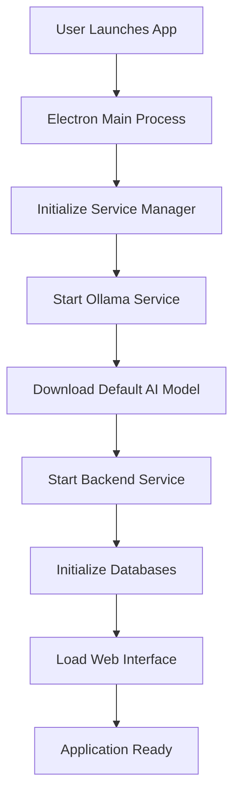

# Brain Cells Desktop - Turnkey Solution

A fully self-contained desktop application version of Brain Cells that runs natively on macOS and Windows without requiring Docker or any external dependencies.

## Architecture Overview

This turnkey solution packages Brain Cells as a native desktop application using:

- **Electron** - Cross-platform desktop application framework
- **Embedded Node.js Backend** - The original aisheets server running as a child process
- **Embedded Ollama** - Local AI inference engine bundled as native binaries
- **SQLite & DuckDB** - Embedded databases (no server required)
- **Automatic Updates** - Built-in update mechanism for seamless upgrades

## Key Features

### ✅ Zero Dependencies
- No Docker required
- No manual installation of Node.js, Python, or other runtimes
- All AI models download automatically on first run
- Complete isolation from system installations

### ✅ Cross-Platform
- **macOS**: Universal binary (Intel & Apple Silicon)
- **Windows**: 64-bit installer with Start Menu integration
- **Linux**: AppImage and .deb packages (optional)

### ✅ User-Friendly Installation
- One-click installers for each platform
- Automatic system integration (file associations, shortcuts)
- Built-in uninstaller
- Automatic updates

### ✅ Resource Efficient
- Smaller footprint than Docker (no virtualization overhead)
- Optimized model loading (loads only what's needed)
- Configurable resource limits
- Background service management

## Project Structure

```
turnkey/
├── src/
│   ├── main.js                 # Electron main process
│   ├── preload.js              # Preload script for security
│   └── services/               # Service management modules
│       ├── serviceManager.js   # Orchestrates all services
│       ├── ollamaService.js    # Manages Ollama AI engine
│       ├── backendService.js   # Manages Node.js backend
│       ├── databaseManager.js  # SQLite/DuckDB management
│       └── modelManager.js     # AI model management
├── resources/
│   ├── ollama/                 # Platform-specific Ollama binaries
│   │   ├── darwin-arm64/       # macOS Apple Silicon
│   │   ├── darwin-x64/         # macOS Intel
│   │   ├── win32-x64/          # Windows 64-bit
│   │   └── linux-x64/          # Linux 64-bit
│   ├── models/                 # Pre-bundled models (optional)
│   ├── icons/                  # Application icons
│   └── app/                    # Built aisheets application
├── build-scripts/
│   ├── download-ollama.js      # Downloads Ollama binaries
│   └── build-app.js            # Main build orchestrator
├── installers/                 # Platform-specific installers
├── dist/                       # Build output directory
└── package.json                # Electron app configuration
```

## Building the Application

### Prerequisites

1. Node.js 18+ and npm installed on build machine
2. For macOS builds: macOS with Xcode Command Line Tools
3. For Windows builds: Windows with Visual Studio Build Tools
4. About 20GB free disk space for models and build artifacts

### Build Steps

1. **Clone and setup the repository:**
```bash
cd braincells
cd turnkey
npm install
```

2. **Build for all platforms:**
```bash
npm run build
```

Or build for specific platforms:
```bash
npm run build:mac    # macOS only
npm run build:win    # Windows only
```

3. **Output files:**
   - macOS: `dist/Brain Cells-1.0.0.dmg` and `.zip`
   - Windows: `dist/Brain Cells Setup 1.0.0.exe` and portable `.exe`

## How It Works

### 1. Application Startup Flow



### 2. Service Architecture

The application uses a microservices architecture with process isolation:

- **Main Process (Electron)**: Manages window, menus, and coordinates services
- **Ollama Process**: Runs as separate process for AI inference
- **Backend Process**: Node.js server running the aisheets application
- **Renderer Process**: Chromium instance displaying the web interface

### 3. Data Storage

All user data is stored in platform-specific locations:

- **macOS**: `~/Library/Application Support/Brain Cells/`
- **Windows**: `%APPDATA%/Brain Cells/`
- **Linux**: `~/.config/Brain Cells/`

Structure:
```
Brain Cells/
├── data/                    # Application data
│   ├── production/         
│   │   ├── .sqlite3        # Main database
│   │   ├── duckdb/         # Analytics database
│   │   └── embeddings/     # Vector database
├── ollama/                 # Ollama data
│   └── models/             # Downloaded AI models
└── logs/                   # Application logs
```

### 4. Model Management

The application includes intelligent model management:

1. **Default Model**: Automatically downloads Llama 3.2 3B on first run (2GB)
2. **Model Selection**: Users can download additional models through UI
3. **Offline Mode**: Can bundle models for offline installation
4. **Cloud Fallback**: Supports OpenAI/Anthropic APIs if local models unavailable

### 5. Security Features

- **Process Isolation**: Each service runs in separate process
- **Context Isolation**: Electron context isolation enabled
- **No Node Integration**: Renderer has no direct Node.js access
- **Secure IPC**: Whitelisted IPC channels only
- **Code Signing**: Supports code signing for distribution

## Installation for End Users

### macOS Installation

1. Download `Brain Cells-1.0.0.dmg`
2. Open the DMG file
3. Drag Brain Cells to Applications folder
4. Launch from Applications
5. First run will download AI models (2GB)

### Windows Installation

1. Download `Brain Cells Setup 1.0.0.exe`
2. Run the installer
3. Choose installation directory
4. Click Install
5. Launch from Start Menu or Desktop shortcut
6. Windows Defender may show a warning - click "More info" then "Run anyway"

## Advanced Configuration

### Environment Variables

Create a `.env` file in the application data directory:

```env
# AI Provider Keys (optional)
HF_TOKEN=your_huggingface_token
OPENAI_API_KEY=your_openai_key
ANTHROPIC_API_KEY=your_anthropic_key

# Resource Limits
OLLAMA_NUM_PARALLEL=2
OLLAMA_MAX_LOADED_MODELS=2
OLLAMA_KEEP_ALIVE=10m

# Custom Ports
BACKEND_PORT=3000
OLLAMA_PORT=11434
```

### Command Line Flags

```bash
# Development mode with DevTools
Brain\ Cells.app/Contents/MacOS/Brain\ Cells --dev

# Custom data directory
Brain\ Cells.app/Contents/MacOS/Brain\ Cells --user-data-dir=/custom/path

# Disable GPU acceleration
Brain\ Cells.app/Contents/MacOS/Brain\ Cells --disable-gpu
```

## Troubleshooting

### Common Issues

1. **"Application can't be opened" on macOS**
   - Right-click the app and select "Open"
   - Or go to System Preferences > Security & Privacy and click "Open Anyway"

2. **Model download fails**
   - Check internet connection
   - Ensure at least 2GB free disk space
   - Try restarting the application

3. **High memory usage**
   - Reduce parallel inference in settings
   - Use smaller models (Phi-3 Mini instead of GPT-OSS)
   - Close unused datasets

4. **Application won't start**
   - Check logs in: `~/Library/Application Support/Brain Cells/logs/`
   - Delete data folder to reset: `~/Library/Application Support/Brain Cells/`
   - Reinstall the application

### Debug Mode

Enable debug logging by setting environment variable:
```bash
DEBUG=brain-cells:* /Applications/Brain\ Cells.app/Contents/MacOS/Brain\ Cells
```

## Development

### Setting Up Development Environment

```bash
# Install dependencies
cd turnkey
npm install

# Run in development mode
npm run dev

# Run tests
npm test

# Package without building installers
npm run pack
```

### Adding New Models

Edit `src/services/modelManager.js` to add new models:

```javascript
'your-model:size': {
  name: 'Display Name',
  size: 'Download Size',
  description: 'Model description',
  capabilities: ['text-generation'],
  recommended: true
}
```

### Customizing the Build

Edit `package.json` build configuration:

```json
{
  "build": {
    "productName": "Your App Name",
    "appId": "com.yourcompany.yourapp",
    "mac": {
      "category": "public.app-category.productivity"
    }
  }
}
```

## Advantages Over Docker Solution

| Feature | Docker Solution | Turnkey Desktop |
|---------|----------------|-----------------|
| Installation | Requires Docker Desktop | Single installer |
| Disk Space | ~20GB (includes Docker) | ~5GB + models |
| Performance | Virtualization overhead | Native performance |
| Updates | Manual container updates | Automatic updates |
| System Integration | Limited | Full OS integration |
| Resource Usage | Higher (virtualization) | Lower (native) |
| Offline Usage | Requires pre-pull | Works offline |
| User Experience | Technical knowledge needed | Consumer-friendly |

## Security Considerations

### Code Signing (Production)

For distribution, code sign the application:

**macOS:**
```bash
# Requires Apple Developer Certificate
electron-builder --mac --config.mac.identity="Developer ID Application: Your Name"
```

**Windows:**
```bash
# Requires Code Signing Certificate
electron-builder --win --config.win.certificateFile=cert.pfx
```

### Auto-Updates

Configure auto-updates by setting up a release server:

```javascript
// In package.json
"build": {
  "publish": {
    "provider": "github",
    "owner": "your-org",
    "repo": "brain-cells"
  }
}
```

## Future Enhancements

### Planned Features

1. **Offline Model Bundles**: Pre-package models for offline installation
2. **Model Marketplace**: In-app model discovery and installation
3. **Cloud Sync**: Sync datasets across devices
4. **Plugin System**: Extensibility through plugins
5. **Multi-User Support**: User profiles and permissions
6. **GPU Acceleration**: CUDA/Metal support for faster inference
7. **Mobile Companion**: iOS/Android apps for viewing data

### Performance Optimizations

1. **Model Quantization**: Reduce model size with minimal quality loss
2. **Lazy Loading**: Load services only when needed
3. **Incremental Updates**: Delta updates instead of full downloads
4. **Caching Layer**: Intelligent response caching
5. **Background Processing**: Queue system for long-running tasks

## License

[Specify your license here]

## Support

For issues and questions:
- GitHub Issues: [your-repo-url]
- Email: support@braincells.ai
- Documentation: https://braincells.ai/docs

## Contributing

Contributions are welcome! Please read CONTRIBUTING.md for guidelines.

---

Built with ❤️ using Electron, Node.js, and Ollama